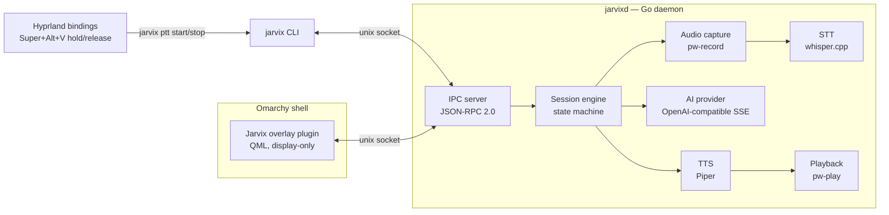
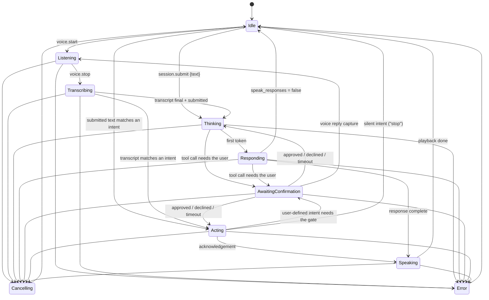

# Jarvix architecture

Jarvix is two processes and a protocol:



**All intelligence lives in the daemon.** The QML overlay renders daemon
state and events; it holds no session logic, no provider logic, and no audio
code. The CLI is a thin protocol client. This means every behaviour is
testable without a GUI and scriptable without a microphone.

## The daemon (`jarvixd`)

Package layout (all internal — Jarvix exposes no Go API yet):

| Package | Responsibility |
|---|---|
| `internal/config` | TOML config, XDG paths, defaults, validation, redaction |
| `internal/session` | State machine, event bus, session engine (the core) |
| `internal/ipc` | JSON-RPC 2.0 server/client over the unix socket |
| `internal/ai` | `Provider` interface + fake; `ai/openaicompat` SSE client |
| `internal/stt` | `Transcriber` interface + fake; `stt/whispercpp` adapter |
| `internal/tts` | `Synthesizer` interface + fake; `tts/piper` adapter |
| `internal/audio` | `Recorder`/`Player` interfaces + fakes; PipeWire impl |
| `internal/intent` | Deterministic intent router: grammar table, slot parsing, command runner |
| `internal/daemon` | Wires config → engines → IPC methods |
| `internal/doctor` | Environment checks with actionable fixes |

The spec's top-level `providers/`, `speech/`, `tts/` directories were folded
into `internal/` — Go convention keeps non-exported implementation together,
and it avoids package proliferation (see the brief, §3).

## Session lifecycle

One authoritative state, explicit transitions, tested exhaustively
(`internal/session/state.go`):



A session proceeds from `Transcribing` to `Thinking` only when **both** the
final transcript has arrived **and** the client has submitted — whichever
order those happen in. Push-to-talk release sends `voice.stop` +
`session.submit` back-to-back; `jarvix ask` sends `session.submit` with text
and skips audio entirely.

### Deterministic intents

Before a transcript reaches the model it is offered to an explicit grammar
table ([ADR 0017](adr/0017-deterministic-intent-router.md)). "Volume thirty",
"mute", "workspace four", "stop talking" and their table-mates execute a
fixed local command in microseconds, acknowledge in one phrase, and finish
the session — no provider request is ever opened, which is why they get their
own state (`Acting`) rather than borrowing `Thinking`. Matching is strict and
whole-utterance: a near-miss like "turn it up a bit" is not claimed, and
reaches the assistant exactly as it did before the router existed (~230ns
later). A matched intent is still committed to conversation history, so the
follow-up that *does* reach the model has the context. User-defined intents
(`[[intents.custom]]`) run real shell commands and therefore pass the same
permission gate the model's tool calls do.

### Desktop context

A transcript the router does not claim goes to the model — and only then does
Jarvix look at the screen ([ADR 0019](adr/0019-desktop-context.md)). Inside
`think()`, before the request is built, the enabled sources (active window,
primary selection, clipboard) are gathered in parallel by short-lived
subprocesses (`hyprctl`, `wl-paste`) inside a 300ms budget, redacted, capped,
and inserted as one delimited `system` message immediately before the user's
question.

The placement is the design: gathering at session start would charge every
deterministic intent for a capture it never uses, so context lives on the
model path and nowhere else. Sources are opt-in per source (`[context]`, with
the clipboard off by default) and a disabled source has no gatherer at all —
nothing is executed. Whatever was captured is retained for `context.last` /
`jarvix status --last`, published as a `context.captured` event carrying sizes
only, never logged, and never written to disk.

### Tool confirmations

Every tool call passes a permission gate before it executes
([ADR 0014](adr/0014-tool-permission-gate.md)): allow-listed read-only
commands run silently, deny-listed patterns never run, and everything else
pauses the session in `AwaitingConfirmation` — Jarvix speaks a one-sentence
summary generated from the parsed command, publishes the exact command
(`tool.confirmation_required`), and waits. The user answers with
`jarvix confirm`/`jarvix deny`, a typed `session.submit`, or by voice: a
push-to-talk press while awaiting flows into the pending confirmation
(`AwaitingConfirmation → Listening → Transcribing`), and the transcript is
read as yes/no. A decline, a 30-second timeout, or an interruption returns
"declined by user" to the model — the tool loop continues so the assistant
can answer gracefully, and nothing has executed.

### Delegating to a stronger assistant

A request beyond the local model is handed to an assistant CLI the user has
installed and authenticated, and its answer is spoken back
([ADR 0016](adr/0016-advisor-delegation.md)). It is an ordinary tool
(`advisor.ask`) behind the same gate: the model chooses which configured
advisor and what to ask, while the binary, argv, environment, and timeout
come from `[advisors.<name>]`. No shell is involved, the question is a single
argument or stdin, the child runs in its own process group (killed as a group
on timeout or cancellation) with credentials scrubbed from its environment,
and the answer is capped at 64 KB. Consulting an advisor that only answers is
silent; one that can act on the machine — or one running a hand-written
command line — asks first. Because a consultation can take minutes, the tool
declares a label (`tool.started` `detail`, shown for the duration) and Jarvix
says once, after ten seconds, that it is still working (`tool.progress`).

### Cancellation and interruption

Every stage runs under one `context.Context` per session. Cancelling it:

- kills `pw-record` (SIGINT first, so the WAV header is finalised)
- kills `whisper-cli`
- aborts the HTTP stream to the provider
- kills `piper`
- kills `pw-play` — speech stops the same instant

`session.start` while a session is active **cancels the running session
first** — invoking Jarvix while it is speaking interrupts it and starts
listening. This is the engine's contract, not UI behaviour.

### Failure isolation

A provider error, engine crash, or audio failure fails *the session*, never
the daemon: the engine publishes an `error` event with the failing stage and
returns to `Idle`. External engines (whisper-cli, piper, pw-*) run as
short-lived subprocesses, so native crashes cannot take jarvixd down
([ADR 0002](adr/0002-external-engine-processes.md)).

## Audio path

PipeWire only, by design ([ADR 0003](adr/0003-pipewire-direct.md)):

- **Capture** — `pw-record --rate 16000 --channels 1 --format s16` into a WAV
  under `$XDG_RUNTIME_DIR/jarvix/` (tmpfs; deleted after transcription).
  16 kHz mono is what whisper.cpp wants; PipeWire resamples.
- **Playback** — Piper emits raw s16le PCM which is piped straight into
  `pw-play --raw` at the voice's native rate. Chunks flow as they are
  synthesized, so playback starts before synthesis finishes.

## Event flow (streaming)

```text
provider SSE chunk → engine → bus → IPC notification → overlay/CLI render
```

The daemon's event bus fans out to every connected IPC client. Publishing
never blocks: a stalled client drops events rather than wedging the engine.
The full event vocabulary is in [ipc.md](ipc.md).

## The Omarchy plugin

`plugin/omarchy/` is a third-party Omarchy shell plugin (kind `panel`,
`keepLoaded`) installed by symlink into `~/.config/omarchy/plugins/jarvix/`.
It connects to `$XDG_RUNTIME_DIR/jarvix.sock` with Quickshell's `Socket`,
follows `state.changed` / `transcript.*` / `assistant.*` events, and shows a
top-centre card on the Wayland overlay layer. It is input-transparent (empty
input region) — Escape-to-cancel is a Hyprland binding, not window focus
([ADR 0004](adr/0004-keyboard-activation.md)).

The same plugin also owns the **conversation window** (`JarvixWindow.qml`):
a normal toplevel showing the full current conversation, opened by clicking
the desktop notification the daemon sends when a session finishes, or by
`jarvix window` / `Super+Alt+C`. It renders the `conversation.get` snapshot
and live-appends from the same event stream as the overlay; its socket is
connected only while it is open. Notifications go out via `notify-send`
(`org.freedesktop.Notifications`) from a bus subscriber inside the daemon —
`ui.notifications` / `ui.notification_preview` control them (see
[configuration.md](configuration.md)). Window technology choice:
[ADR 0013](adr/0013-conversation-window-in-shell-plugin.md).

Assumptions about the installed Omarchy version are recorded in
[ADR 0005](adr/0005-omarchy-plugin-integration.md).

## Keyboard activation

**Primary: daemon-side hold-to-talk.** jarvixd watches keyboard event
devices (evdev) for the configured chord (`activation.ptt_chord`, default
Super+Alt+V): all keys down → listening; any key released → submit. This
bypasses compositor bindings entirely — Hyprland release-binds misfire for
modifier chords — and is the mechanism every Linux push-to-talk app uses.
Requires read access to keyboards (`jarvix setup input`); non-chord key
events are discarded immediately and never logged
([ADR 0008](adr/0008-daemon-side-push-to-talk.md)).

**Fallback: Hyprland bindings** ([ADR 0004](adr/0004-keyboard-activation.md)),
active automatically when input devices are not readable:

```lua
o.bind("SUPER + ALT + V", "Talk to Jarvix (tap to start/stop)", "jarvix ptt toggle")
o.bind("F10", "Talk to Jarvix (hold)", "jarvix ptt start")
o.bind("F10", "Submit to Jarvix", "jarvix ptt stop", { release = true })
```

`jarvix ptt toggle` checks `status.get` first: when the daemon owns the
chord (`ptt: "daemon"`) it no-ops so the two paths never fight; otherwise
idle → listen, listening → submit, other active states → interrupt and
listen. All are thin socket calls returning in milliseconds.
