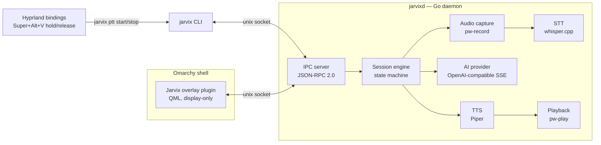
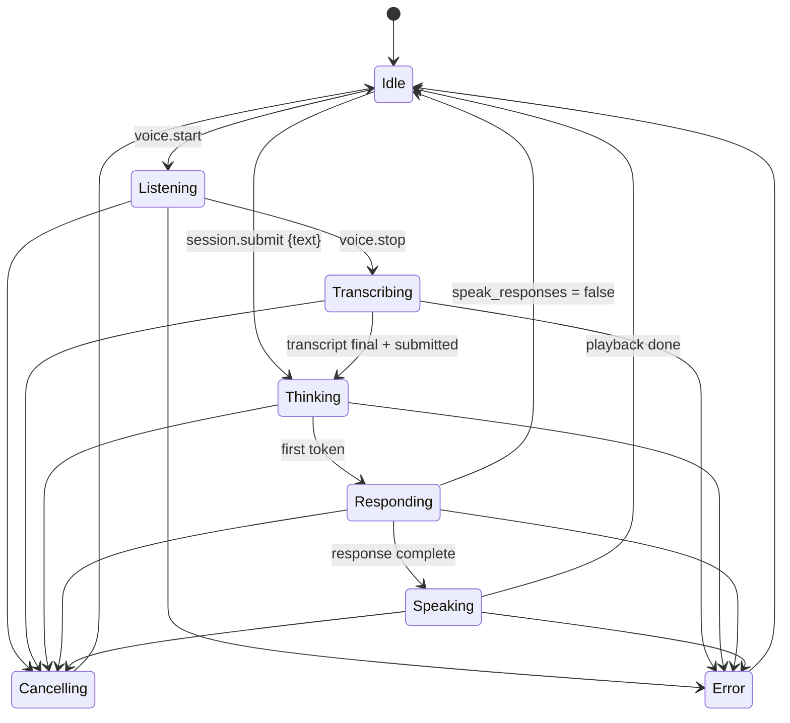

# Jarvix architecture

Jarvix is two processes and a protocol:



**All intelligence lives in the daemon.** The QML overlay renders daemon
state and events; it holds no session logic, no provider logic, and no audio
code. The CLI is a thin protocol client. This means every behaviour is
testable without a GUI and scriptable without a microphone.

## The daemon (`jarvixd`)

Package layout (all internal — Jarvix exposes no Go API yet):

| Package | Responsibility |
|---|---|
| `internal/config` | TOML config, XDG paths, defaults, validation, redaction |
| `internal/session` | State machine, event bus, session engine (the core) |
| `internal/ipc` | JSON-RPC 2.0 server/client over the unix socket |
| `internal/ai` | `Provider` interface + fake; `ai/openaicompat` SSE client |
| `internal/stt` | `Transcriber` interface + fake; `stt/whispercpp` adapter |
| `internal/tts` | `Synthesizer` interface + fake; `tts/piper` adapter |
| `internal/audio` | `Recorder`/`Player` interfaces + fakes; PipeWire impl |
| `internal/daemon` | Wires config → engines → IPC methods |
| `internal/doctor` | Environment checks with actionable fixes |

The spec's top-level `providers/`, `speech/`, `tts/` directories were folded
into `internal/` — Go convention keeps non-exported implementation together,
and it avoids package proliferation (see the brief, §3).

## Session lifecycle

One authoritative state, explicit transitions, tested exhaustively
(`internal/session/state.go`):



A session proceeds from `Transcribing` to `Thinking` only when **both** the
final transcript has arrived **and** the client has submitted — whichever
order those happen in. Push-to-talk release sends `voice.stop` +
`session.submit` back-to-back; `jarvix ask` sends `session.submit` with text
and skips audio entirely.

### Cancellation and interruption

Every stage runs under one `context.Context` per session. Cancelling it:

- kills `pw-record` (SIGINT first, so the WAV header is finalised)
- kills `whisper-cli`
- aborts the HTTP stream to the provider
- kills `piper`
- kills `pw-play` — speech stops the same instant

`session.start` while a session is active **cancels the running session
first** — invoking Jarvix while it is speaking interrupts it and starts
listening. This is the engine's contract, not UI behaviour.

### Failure isolation

A provider error, engine crash, or audio failure fails *the session*, never
the daemon: the engine publishes an `error` event with the failing stage and
returns to `Idle`. External engines (whisper-cli, piper, pw-*) run as
short-lived subprocesses, so native crashes cannot take jarvixd down
([ADR 0002](adr/0002-external-engine-processes.md)).

## Audio path

PipeWire only, by design ([ADR 0003](adr/0003-pipewire-direct.md)):

- **Capture** — `pw-record --rate 16000 --channels 1 --format s16` into a WAV
  under `$XDG_RUNTIME_DIR/jarvix/` (tmpfs; deleted after transcription).
  16 kHz mono is what whisper.cpp wants; PipeWire resamples.
- **Playback** — Piper emits raw s16le PCM which is piped straight into
  `pw-play --raw` at the voice's native rate. Chunks flow as they are
  synthesized, so playback starts before synthesis finishes.

## Event flow (streaming)

```text
provider SSE chunk → engine → bus → IPC notification → overlay/CLI render
```

The daemon's event bus fans out to every connected IPC client. Publishing
never blocks: a stalled client drops events rather than wedging the engine.
The full event vocabulary is in [ipc.md](ipc.md).

## The Omarchy plugin

`plugin/omarchy/` is a third-party Omarchy shell plugin (kind `panel`,
`keepLoaded`) installed by symlink into `~/.config/omarchy/plugins/jarvix/`.
It connects to `$XDG_RUNTIME_DIR/jarvix.sock` with Quickshell's `Socket`,
follows `state.changed` / `transcript.*` / `assistant.*` events, and shows a
top-centre card on the Wayland overlay layer. It is input-transparent (empty
input region) — Escape-to-cancel is a Hyprland binding, not window focus
([ADR 0004](adr/0004-keyboard-activation.md)).

Assumptions about the installed Omarchy version are recorded in
[ADR 0005](adr/0005-omarchy-plugin-integration.md).

## Keyboard activation

Hyprland delivers reliable release events only for bare keys, so the chord
taps and the bare key holds ([ADR 0004](adr/0004-keyboard-activation.md)):

```lua
o.bind("SUPER + ALT + V", "Talk to Jarvix (tap to start/stop)", "jarvix ptt toggle")
o.bind("F10", "Talk to Jarvix (hold)", "jarvix ptt start")
o.bind("F10", "Submit to Jarvix", "jarvix ptt stop", { release = true })
```

`jarvix ptt toggle` checks daemon state: idle → `session.start` +
`voice.start`; listening → `voice.stop` + `session.submit`; anything else
active → interrupt and listen. `start`/`stop` are the raw halves for the
hold binding. All are thin socket calls returning in milliseconds.
